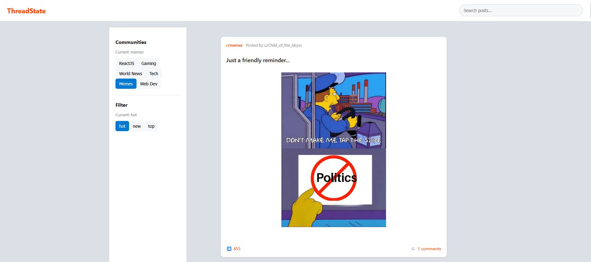
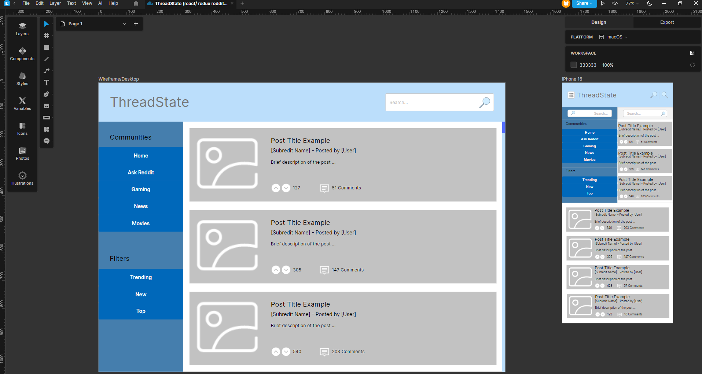
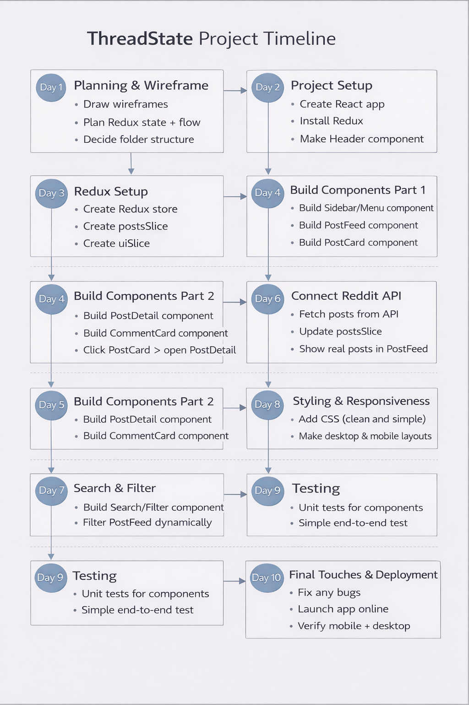

# ThreadState (React + Redux Reddit client App)

This project is a **Reddit** client built with **React** and **Redux** Toolkit. 
It allows users to browse posts from different subreddits, search for content, and view comment discussions using the **Reddit** public **API**.

## Live Demo

👉 https://C0DREA.github.io/ThreadState/

## Screenshot


## Features

* Browse Reddit posts from popular subreddits
* Search posts by keyword
* View detailed post information
* Display comment threads
* Responsive layout
* Loading states and error handling
* Clean component-based architecture

## Technologies Used

* React
* Redux Toolkit
* Vite
* CSS Modules
* Reddit JSON API

## Wireframe



## Timeline followed



## Project Structure

```
src
 ├── components
 │   ├── CommentCard
 │   │   ├── CommentCard.jsx
 │   │   └── CommentCard.module.css
 │   │
 │   ├── PostCard
 │   │   ├── PostCard.jsx
 │   │   └── PostCard.module.css
 │   │
 │   ├── PostDetail
 │   │   ├── PostDetail.jsx
 │   │   └── PostDetail.module.css
 │   │
 │   ├── PostFeed
 │   │   ├── PostFeed.jsx
 │   │   └── PostFeed.module.css
 │   │
 │   ├── SearchBar
 │   │   ├── SearchBar.jsx
 │   │   └── SearchBar.module.css
 │   │
 │   ├── Spinner
 │   │   ├── Spinner.jsx
 │   │   └── Spinner.module.css
 │   │
 │   └── SubredditList
 │       ├── SubredditList.jsx
 │       └── SubredditList.module.css
 │
 ├── redux
 │   ├── postsSlice.js
 │   ├── uiSlice.js
 │   └── store.js
 │
 ├── App.jsx
 ├── App.module.css
 ├── index.css
 ├── main.jsx

```

## Installation

Clone the repository:

```
git clone https://github.com/C0DREA/ThreadState.git
```

Go into the project folder:

```
cd ThreadState
```

Install dependencies:

```
npm install
```

Run the development server:

```
npm run dev
```

The app will run locally at:

```
http://localhost:5173
```

## How It Works

This app fetches data from the Reddit public JSON API.

Examples:

```
https://www.reddit.com/r/reactjs.json
https://www.reddit.com/r/javascript/comments/{postId}.json
```

Redux Toolkit manages:

* posts
* comments
* loading states
* selected post UI

## Known Limitations

Due to CORS (Cross-Origin Resource Sharing) restrictions imposed by the Reddit public API, the deployed version of this application on GitHub Pages may not consistently fetch data.

The application works correctly in a local development environment (`localhost`), but when deployed as a static frontend, some requests to the Reddit API may be blocked by the browser.

This limitation exists because the project does not include a backend or proxy server to handle API requests.

### Possible Solutions

* Implement a backend proxy (Node.js / Express)
* Use serverless functions (Netlify / Vercel)
* Integrate an official API with proper authentication

This project focuses on frontend architecture and state management using React and Redux Toolkit, and the API limitation does not affect its core learning objectives.


## Future Improvements

* Dark mode
* Pagination / infinite scroll
* Improved comment threading
* Mobile UI improvements
* Subreddit filtering

## Author

Built by **C0DREA**, part of a React learning project.
GitHub: https://github.com/C0DREA
